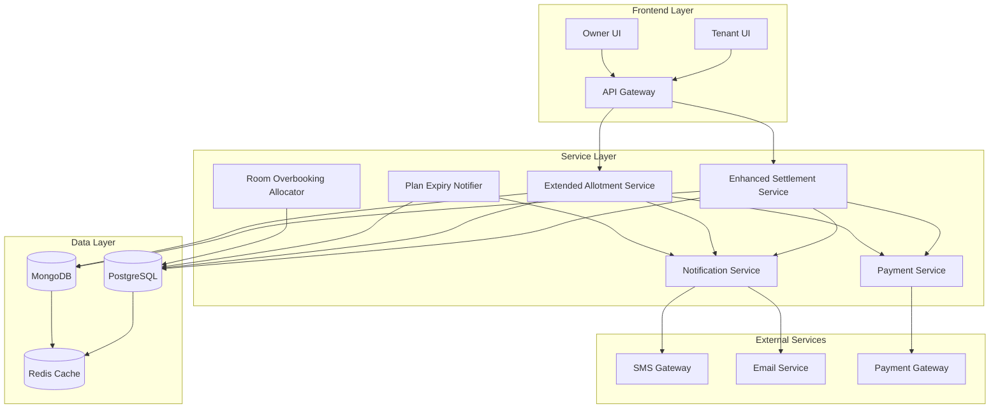
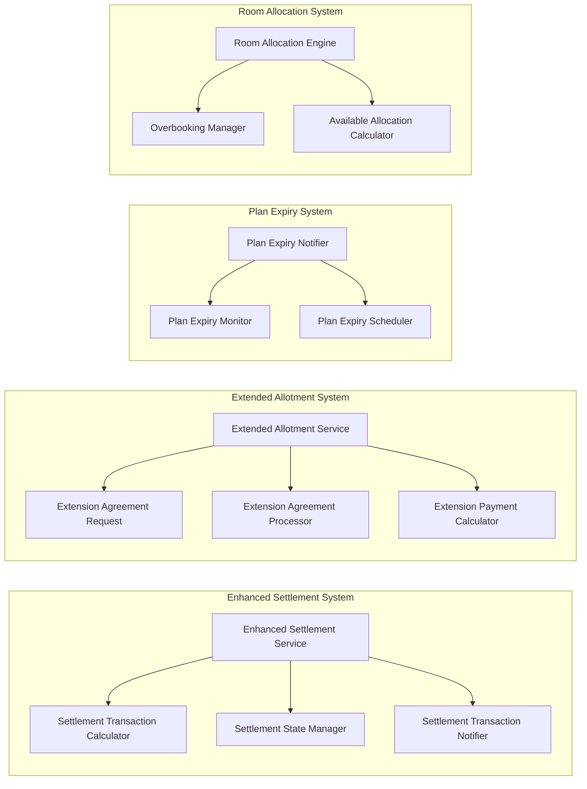
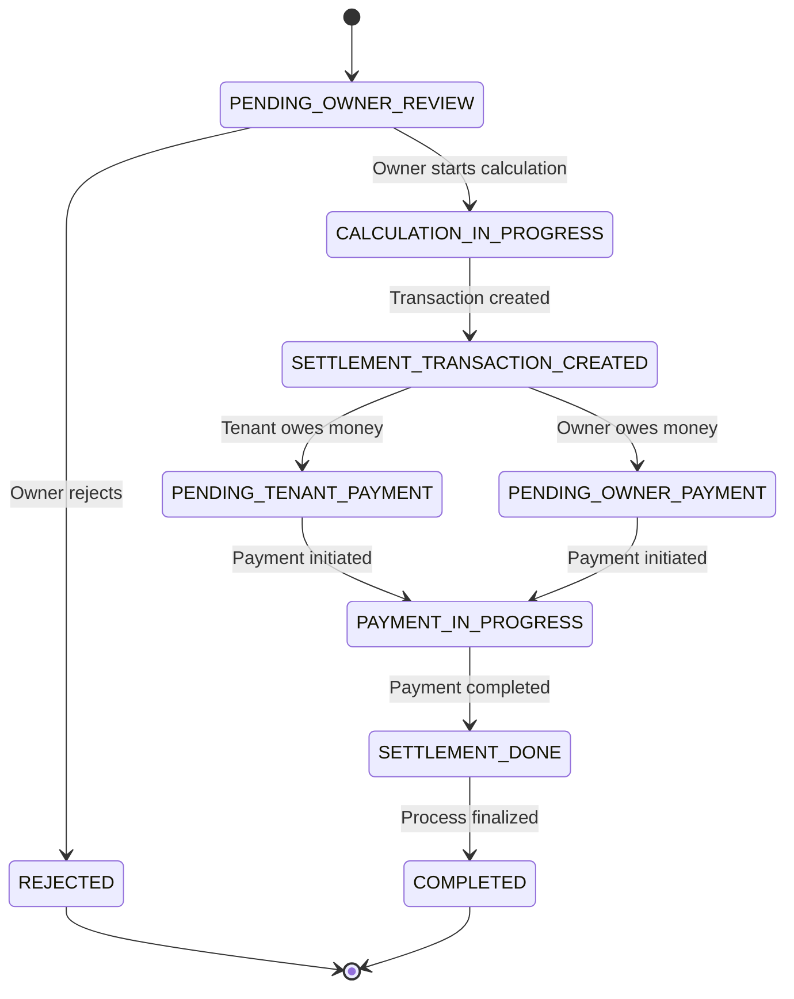
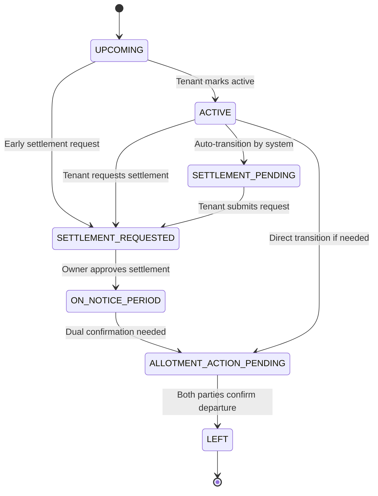
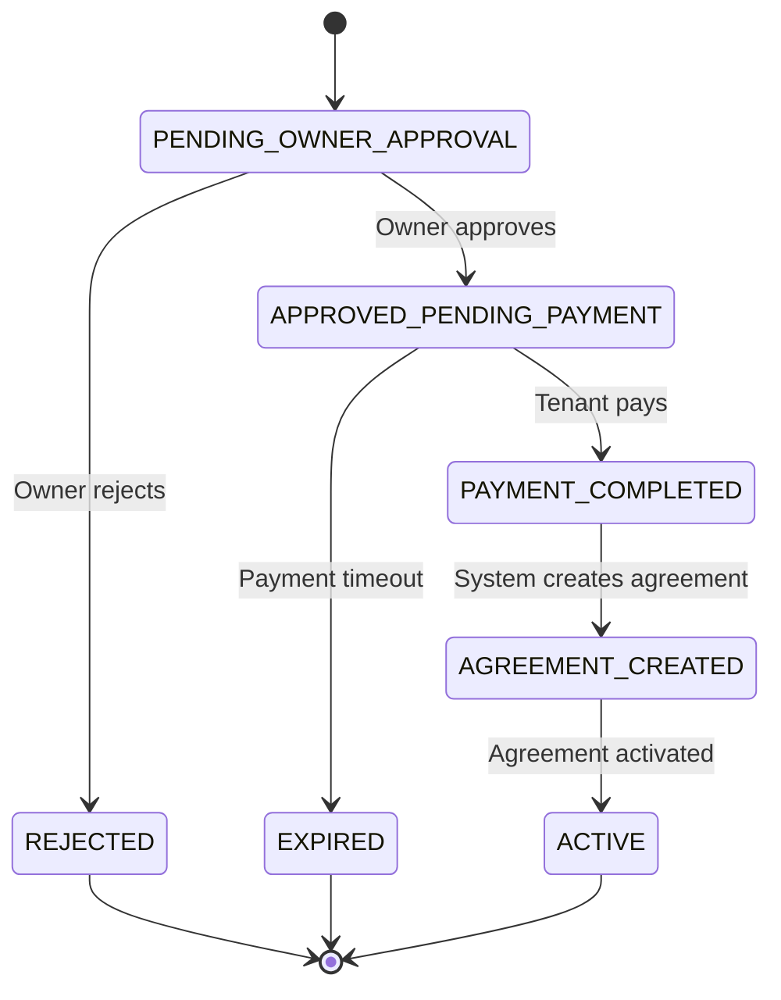
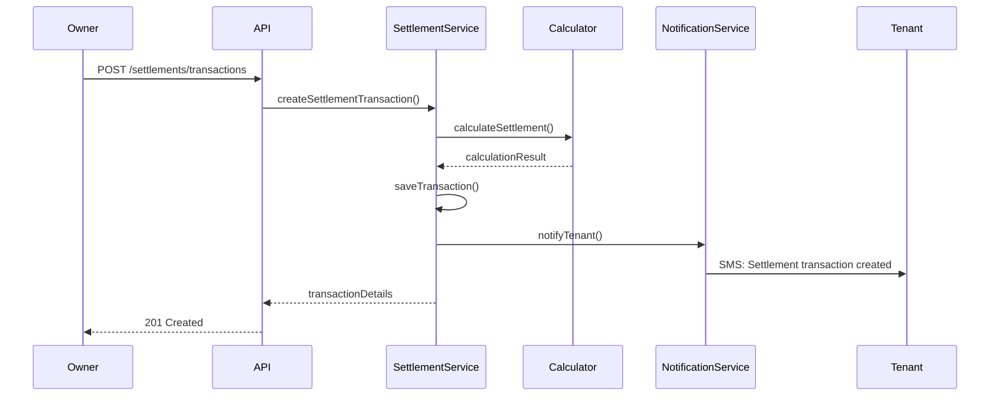
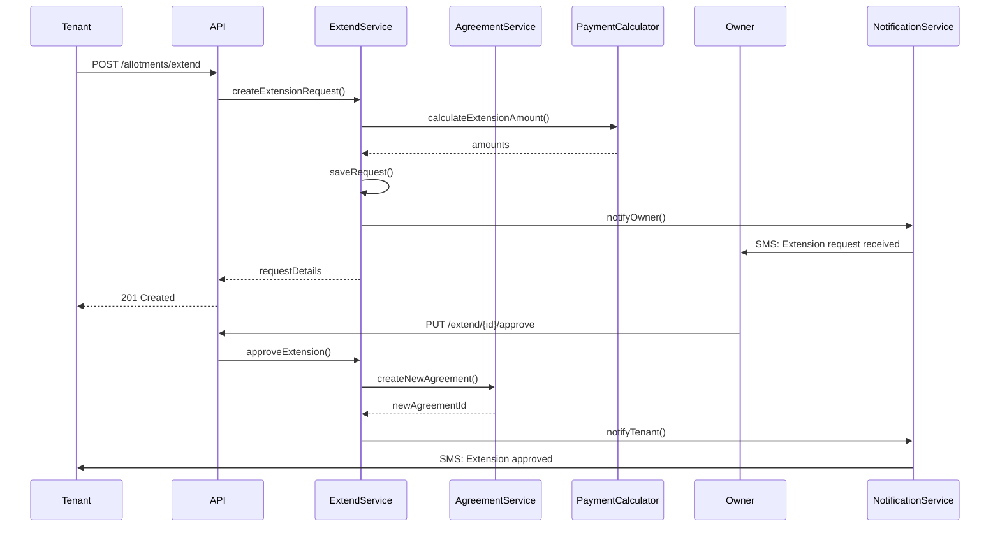
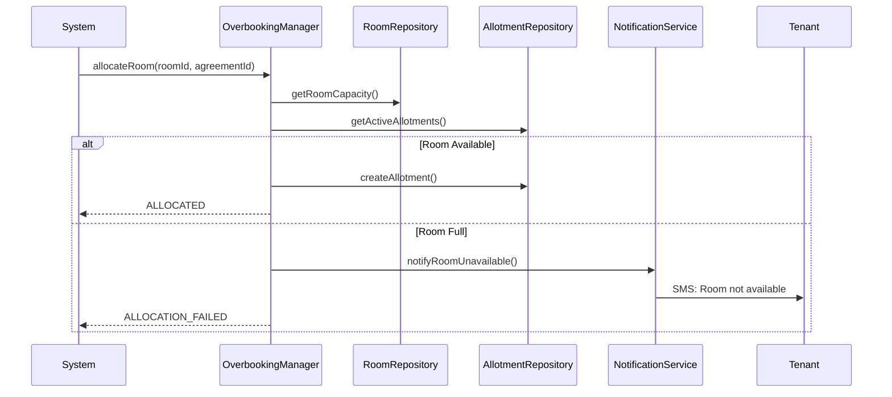

# Enhanced Settlement and Allotment System - Design Document

## Table of Contents
1. [System Overview](#system-overview)
2. [Architecture](#architecture) 
3. [Database Design](#database-design)
4. [Service Layer Design](#service-layer-design)
5. [API Specifications](#api-specifications)
6. [State Management](#state-management)
7. [Component Interactions](#component-interactions)
8. [Error Handling](#error-handling)
9. [Performance Considerations](#performance-considerations)
10. [Security Considerations](#security-considerations)

## System Overview

The Enhanced Settlement and Allotment System extends the existing hostel management platform to provide comprehensive workflow management for tenant settlements, room allotment lifecycles, and agreement extensions. The system integrates plan expiry notifications, enhanced settlement workflows, extend allotment requests, and advanced room allocation with overbooking support.

### Key Features
- **Plan Expiry Notifications**: Automated notifications when tenant plans approach expiry
- **Enhanced Settlement Workflow**: Extended settlement states supporting early settlement requests
- **Extend Allotment System**: Seamless accommodation extensions with payment integration
- **Advanced Room Allocation**: Overbooking support with first-come-first-served allocation
- **Complex State Management**: Enhanced status transitions for allotments and settlements

### Integration Points
- **Existing Settlement Service**: Extends `SettlementService` with new workflows
- **Room Allotment System**: Enhances `RoomAllotment` entity with new statuses
- **Notification Infrastructure**: Leverages `NotificationService` for automated alerts
- **Payment System**: Integrates with existing payment processing for extensions
- **MongoDB Agreements**: Works with existing `Agreement` collection

## Architecture

### High-Level Architecture



### Component Architecture



## Database Design

### Enhanced Entities

#### 1. Extended SettlementRequest Entity
```sql
-- Enhanced settlement_requests table
ALTER TABLE settlement_requests ADD COLUMN IF NOT EXISTS settlement_transaction_data JSONB;
ALTER TABLE settlement_requests ADD COLUMN IF NOT EXISTS early_settlement_requested BOOLEAN DEFAULT FALSE;
ALTER TABLE settlement_requests ADD COLUMN IF NOT EXISTS settlement_approved_by UUID REFERENCES users(user_id);
ALTER TABLE settlement_requests ADD COLUMN IF NOT EXISTS auto_settlement_eligible BOOLEAN DEFAULT FALSE;

-- New settlement statuses
ALTER TABLE settlement_requests DROP CONSTRAINT IF EXISTS settlement_requests_status_check;
ALTER TABLE settlement_requests ADD CONSTRAINT settlement_requests_status_check 
    CHECK (status IN (
        'PENDING_OWNER_REVIEW', 
        'CALCULATION_IN_PROGRESS', 
        'PENDING_TENANT_PAYMENT', 
        'PENDING_OWNER_PAYMENT', 
        'PAYMENT_IN_PROGRESS', 
        'SETTLEMENT_TRANSACTION_CREATED',
        'SETTLEMENT_APPROVED',
        'SETTLEMENT_DONE',
        'COMPLETED', 
        'CANCELLED', 
        'REJECTED'
    ));
```

#### 2. New Extend Allotment Request Table
```sql
CREATE TABLE IF NOT EXISTS extend_allotment_requests (
    extend_request_id UUID PRIMARY KEY DEFAULT gen_random_uuid(),
    
    -- References
    tenant_id UUID NOT NULL REFERENCES users(user_id) ON DELETE CASCADE,
    owner_id UUID NOT NULL REFERENCES users(user_id) ON DELETE CASCADE,
    current_agreement_id VARCHAR(255) NOT NULL, -- MongoDB Agreement ID
    current_room_id UUID REFERENCES rooms(room_id) ON DELETE SET NULL,
    
    -- Extension Details
    new_plan_id UUID NOT NULL REFERENCES room_agreement_plans(plan_id),
    extension_start_date DATE NOT NULL,
    extension_end_date DATE NOT NULL,
    
    -- Status
    status VARCHAR(50) NOT NULL DEFAULT 'PENDING_OWNER_APPROVAL' 
        CHECK (status IN (
            'PENDING_OWNER_APPROVAL', 
            'APPROVED_PENDING_PAYMENT', 
            'PAYMENT_COMPLETED',
            'AGREEMENT_CREATED',
            'ACTIVE',
            'REJECTED', 
            'CANCELLED',
            'EXPIRED'
        )),
    
    -- Financial Details  
    activation_amount DECIMAL(10,2) NOT NULL DEFAULT 0,
    settlement_adjustment DECIMAL(10,2) DEFAULT 0,
    total_amount DECIMAL(10,2) NOT NULL DEFAULT 0,
    payment_reference VARCHAR(255),
    
    -- New Agreement Reference (after creation)
    new_agreement_id VARCHAR(255),
    
    -- Notes
    tenant_notes VARCHAR(500),
    owner_notes VARCHAR(500),
    
    -- Timestamps
    created_at TIMESTAMP NOT NULL DEFAULT CURRENT_TIMESTAMP,
    updated_at TIMESTAMP DEFAULT CURRENT_TIMESTAMP,
    approved_at TIMESTAMP,
    payment_completed_at TIMESTAMP,
    expires_at TIMESTAMP, -- Auto-cancellation time if payment not completed
    
    -- Constraints
    CONSTRAINT valid_extension_dates CHECK (extension_end_date > extension_start_date),
    CONSTRAINT non_negative_amounts CHECK (
        activation_amount >= 0 AND 
        total_amount >= 0
    )
);

-- Indexes
CREATE INDEX IF NOT EXISTS idx_extend_requests_tenant_status ON extend_allotment_requests(tenant_id, status);
CREATE INDEX IF NOT EXISTS idx_extend_requests_owner_status ON extend_allotment_requests(owner_id, status);  
CREATE INDEX IF NOT EXISTS idx_extend_requests_current_agreement ON extend_allotment_requests(current_agreement_id);
CREATE INDEX IF NOT EXISTS idx_extend_requests_expires_at ON extend_allotment_requests(expires_at);
```

#### 3. Enhanced RoomAllotment Status
```sql
-- Add new statuses to room_allotments
ALTER TABLE room_allotments DROP CONSTRAINT IF EXISTS room_allotments_status_check;
ALTER TABLE room_allotments ADD CONSTRAINT room_allotments_status_check 
    CHECK (room_allotment_status IN (
        'UPCOMING',
        'ACTIVE', 
        'SETTLEMENT_PENDING',
        'SETTLEMENT_REQUESTED',
        'ON_NOTICE_PERIOD',
        'ALLOTMENT_ACTION_PENDING',
        'SETTLEMENT_TASK',
        'LEFT'
    ));

-- Add extension tracking fields
ALTER TABLE room_allotments ADD COLUMN IF NOT EXISTS extension_request_id UUID 
    REFERENCES extend_allotment_requests(extend_request_id) ON DELETE SET NULL;
ALTER TABLE room_allotments ADD COLUMN IF NOT EXISTS is_extension BOOLEAN DEFAULT FALSE;
ALTER TABLE room_allotments ADD COLUMN IF NOT EXISTS parent_allotment_id UUID 
    REFERENCES room_allotments(allotment_id) ON DELETE SET NULL;
```

#### 4. Plan Expiry Notifications Table
```sql
CREATE TABLE IF NOT EXISTS plan_expiry_notifications (
    notification_id UUID PRIMARY KEY DEFAULT gen_random_uuid(),
    
    -- References
    agreement_id VARCHAR(255) NOT NULL,
    tenant_id UUID NOT NULL REFERENCES users(user_id) ON DELETE CASCADE,
    room_allotment_id UUID REFERENCES room_allotments(allotment_id) ON DELETE CASCADE,
    
    -- Notification Details
    notification_type VARCHAR(50) NOT NULL CHECK (notification_type IN (
        'PLAN_EXPIRY_REMINDER',
        'SETTLEMENT_WINDOW_OPEN',  
        'URGENT_ACTION_REQUIRED',
        'FINAL_NOTICE'
    )),
    
    scheduled_date DATE NOT NULL,
    sent_at TIMESTAMP,
    delivery_status VARCHAR(20) DEFAULT 'PENDING' CHECK (delivery_status IN (
        'PENDING', 'SENT', 'DELIVERED', 'FAILED', 'CANCELLED'
    )),
    
    -- Message Content
    message_template VARCHAR(50) NOT NULL,
    message_variables JSONB,
    actual_message TEXT,
    
    -- Metadata
    lead_time_days INTEGER NOT NULL,
    retry_count INTEGER DEFAULT 0,
    last_retry_at TIMESTAMP,
    
    -- Timestamps
    created_at TIMESTAMP NOT NULL DEFAULT CURRENT_TIMESTAMP,
    updated_at TIMESTAMP DEFAULT CURRENT_TIMESTAMP
);

-- Indexes
CREATE INDEX IF NOT EXISTS idx_plan_expiry_notifications_scheduled ON plan_expiry_notifications(scheduled_date, delivery_status);
CREATE INDEX IF NOT EXISTS idx_plan_expiry_notifications_tenant ON plan_expiry_notifications(tenant_id);
CREATE INDEX IF NOT EXISTS idx_plan_expiry_notifications_agreement ON plan_expiry_notifications(agreement_id);
```

#### 5. Room Overbooking Management
```sql
CREATE TABLE IF NOT EXISTS room_overbooking_log (
    overbooking_id UUID PRIMARY KEY DEFAULT gen_random_uuid(),
    
    -- Room Details
    room_id UUID NOT NULL REFERENCES rooms(room_id) ON DELETE CASCADE,
    total_bed_capacity INTEGER NOT NULL,
    
    -- Overbooking Event
    event_type VARCHAR(50) NOT NULL CHECK (event_type IN (
        'AGREEMENT_CREATED',
        'ALLOCATION_SUCCESSFUL', 
        'ALLOCATION_FAILED',
        'OVERBOOKING_DETECTED'
    )),
    
    agreements_count INTEGER NOT NULL,
    pending_action_count INTEGER NOT NULL,
    available_beds INTEGER NOT NULL,
    
    -- Agreement Reference
    agreement_id VARCHAR(255),
    tenant_id UUID REFERENCES users(user_id) ON DELETE SET NULL,
    
    -- Metadata
    allocation_order INTEGER, -- For first-come-first-served tracking
    allocation_successful BOOLEAN,
    failure_reason TEXT,
    
    -- Timestamps
    event_timestamp TIMESTAMP NOT NULL DEFAULT CURRENT_TIMESTAMP
);

-- Indexes
CREATE INDEX IF NOT EXISTS idx_overbooking_log_room_event ON room_overbooking_log(room_id, event_type);
CREATE INDEX IF NOT EXISTS idx_overbooking_log_agreement ON room_overbooking_log(agreement_id);
CREATE INDEX IF NOT EXISTS idx_overbooking_log_timestamp ON room_overbooking_log(event_timestamp);
```
## Service Layer Design

### 1. Enhanced Settlement Service

#### Core Components

```java
@Service
public class EnhancedSettlementService extends SettlementService {
    
    // New Methods for Enhanced Functionality
    
    /**
     * Creates settlement transaction at any time based on current plan
     */
    @Transactional
    public SettlementTransaction createSettlementTransaction(
        UUID agreementId, 
        UUID ownerId,
        SettlementTransactionRequest request
    ) {
        // Validate agreement ownership
        // Calculate settlement based on current plan snapshot
        // Create settlement transaction record
        // Notify tenant immediately
        // Return transaction details
    }
    
    /**
     * Processes early settlement requests (before agreement end)
     */
    @Transactional
    public SettlementRequest processEarlySettlement(
        UUID agreementId,
        UUID tenantId, 
        LocalDate requestedEndDate
    ) {
        // Validate early settlement eligibility
        // Calculate early exit penalties if applicable
        // Create settlement request with early_settlement_requested = true
        // Transition allotment status appropriately
        // Send owner notification
    }
    
    /**
     * Handles settlement approval with room availability update
     */
    @Transactional
    public void approveSettlementWithRoomUpdate(
        UUID settlementId,
        UUID ownerId,
        SettlementApprovalDto approval
    ) {
        // Process settlement approval (existing logic)
        // Update room endDate in allotment
        // Make room visible for new agreements immediately
        // Handle concurrent access scenarios
    }
}
```

#### Settlement Transaction Calculator

```java
@Component
public class SettlementTransactionCalculator {
    
    public SettlementCalculationResult calculateSettlement(
        Agreement agreement,
        RoomAllotment allotment,
        LocalDate calculationDate
    ) {
        // Get plan snapshot from agreement
        // Calculate outstanding rent based on payment plan
        // Include outstanding other charges
        // Apply early exit penalties if applicable
        // Calculate deposit adjustments
        // Return detailed breakdown
    }
    
    public SettlementTransaction parseSettlementData(String transactionData) {
        // Parse JSON settlement transaction data
        // Validate structure and amounts
        // Return SettlementTransaction object
        // Handle parsing errors gracefully
    }
    
    public String formatSettlementTransaction(SettlementTransaction transaction) {
        // Format SettlementTransaction back to JSON
        // Ensure round-trip consistency
        // Handle null values appropriately
    }
}
```

### 2. Extended Allotment Service

#### Core Components

```java
@Service
public class ExtendedAllotmentService {
    
    @Autowired
    private ExtendAllotmentRequestRepository extendRequestRepository;
    
    @Autowired  
    private AgreementService agreementService;
    
    @Autowired
    private PaymentService paymentService;
    
    /**
     * Creates extension request for tenant's current allotment
     */
    @Transactional
    public ExtendAllotmentRequest createExtensionRequest(
        UUID tenantId,
        ExtensionRequestDto requestDto
    ) {
        // Validate current active agreement
        // Validate chosen plan compatibility
        // Calculate extension dates (seamless transition)
        // Calculate activation amount and settlement adjustments
        // Create extension request record
        // Send owner notification
    }
    
    /**
     * Owner approves extension request
     */
    @Transactional
    public void approveExtensionRequest(
        UUID requestId,
        UUID ownerId,
        ExtensionApprovalDto approvalDto
    ) {
        // Validate ownership and request status
        // Create new agreement (MongoDB) in DRAFT status
        // Update extension request with new agreement ID
        // Calculate final payment amount
        // Make extension visible to tenant with Accept button
        // Set expiration timer for payment completion
    }
    
    /**
     * Tenant accepts and pays for extension
     */
    @Transactional  
    public void processExtensionPayment(
        UUID requestId,
        UUID tenantId,
        PaymentDetailsDto paymentDto
    ) {
        // Validate payment completion
        // Activate new agreement
        // Create new room allotment record
        // Update extension request status to ACTIVE
        // Send confirmation notifications
    }
}
```

### 3. Plan Expiry Notification Service

```java
@Service
public class PlanExpiryNotificationService {
    
    @Scheduled(cron = "0 0 8 * * ?") // Daily at 8 AM
    public void processPlanExpiryNotifications() {
        // Find agreements approaching expiry
        // Check configured lead times for each plan
        // Create notification records if not already exists
        // Send notifications based on schedule
        // Update delivery status
    }
    
    public void scheduleExpiryNotifications(Agreement agreement, RoomAllotment allotment) {
        // Calculate notification dates based on plan configuration
        // Create scheduled notification records
        // Configure notification templates and variables
    }
    
    private void sendPlanExpiryNotification(PlanExpiryNotification notification) {
        // Load message template
        // Populate variables (tenant name, end date, options)
        // Send via SMS/Email based on preferences
        // Update delivery status
        // Handle delivery failures with retry logic
    }
}
```

### 4. Room Overbooking Manager

```java
@Service
public class RoomOverbookingManager {
    
    /**
     * Handles room allocation with overbooking support
     */
    public RoomAllocationResult allocateRoom(UUID roomId, String agreementId) {
        // Check room capacity vs active agreements
        // Handle overbooking scenarios (20 agreements for 10 bed room)
        // Implement first-come-first-served allocation
        // Log overbooking events
        // Return allocation result with status
    }
    
    /**
     * Calculates available room display info with pending actions
     */
    public RoomAvailabilityDto getRoomAvailability(UUID roomId) {
        // Count total bed capacity
        // Count active/upcoming allotments
        // Count agreements with "TenantActionPending" status
        // Calculate actual available beds
        // Return display information
    }
    
    /**
     * Processes room allocation failures due to overbooking
     */
    public void handleAllocationFailure(UUID roomId, String agreementId, String reason) {
        // Log allocation failure
        // Notify tenant about room unavailability
        // Suggest alternative rooms if available
        // Cancel agreement if no alternatives
    }
}
```

## API Specifications

### 1. Settlement API Endpoints

#### Create Settlement Transaction
```http
POST /api/v1/settlements/transactions
Authorization: Bearer <owner_token>
Content-Type: application/json

{
  "agreementId": "agreement_123",
  "calculationDate": "2024-01-15",
  "notes": "Monthly settlement calculation"
}

Response 201:
{
  "transactionId": "tx_456", 
  "settlementAmount": 2500.00,
  "settlementType": "OWNER_PAYABLE",
  "calculationBreakdown": {
    "securityDeposit": 5000.00,
    "outstandingRent": 1200.00,
    "outstandingCharges": 300.00,
    "damageCharges": 0.00,
    "totalDeductions": 1500.00,
    "finalAmount": 3500.00
  },
  "notificationSent": true,
  "createdAt": "2024-01-15T10:30:00Z"
}
```

#### Request Early Settlement
```http
POST /api/v1/settlements/early-settlement
Authorization: Bearer <tenant_token>
Content-Type: application/json

{
  "agreementId": "agreement_123",
  "requestedEndDate": "2024-02-01", 
  "reason": "Job relocation",
  "tenantNotes": "Need to vacate early due to job transfer"
}

Response 201:
{
  "settlementId": "settlement_789",
  "status": "SETTLEMENT_REQUESTED",
  "earlyExit": true,
  "penaltiesApplicable": true,
  "estimatedPenalty": 500.00,
  "message": "Early settlement request submitted. Owner will review and respond."
}
```

### 2. Extension Request API Endpoints

#### Create Extension Request
```http
POST /api/v1/allotments/extend
Authorization: Bearer <tenant_token>
Content-Type: application/json

{
  "currentAgreementId": "agreement_123",
  "planId": "plan_456", 
  "tenantNotes": "Would like to extend for another 6 months"
}

Response 201:
{
  "requestId": "ext_request_789",
  "status": "PENDING_OWNER_APPROVAL",
  "extensionStartDate": "2024-03-01",
  "extensionEndDate": "2024-09-01", 
  "activationAmount": 1200.00,
  "settlementAdjustment": -300.00,
  "totalAmount": 900.00,
  "expiresAt": "2024-01-22T10:30:00Z", // 7 days from now
  "message": "Extension request sent to owner for approval"
}
```

#### Owner Approve Extension
```http
PUT /api/v1/allotments/extend/{requestId}/approve  
Authorization: Bearer <owner_token>
Content-Type: application/json

{
  "approved": true,
  "ownerNotes": "Extension approved. Please complete payment within 7 days.",
  "finalActivationAmount": 1200.00
}

Response 200:
{
  "requestId": "ext_request_789",
  "status": "APPROVED_PENDING_PAYMENT", 
  "newAgreementId": "agreement_new_456",
  "paymentAmount": 900.00,
  "paymentDeadline": "2024-01-22T10:30:00Z",
  "message": "Extension approved. New agreement created and visible to tenant."
}
```

### 3. Room Allocation API Endpoints

#### Get Room Availability
```http
GET /api/v1/rooms/{roomId}/availability
Authorization: Bearer <owner_token>

Response 200:
{
  "roomId": "room_123",
  "roomNumber": "A-101", 
  "totalBedCapacity": 10,
  "currentOccupancy": 8,
  "tenantActionPendingCount": 3,
  "actualAvailableBeds": 2,
  "overbookingDetected": false,
  "allocationStatus": "AVAILABLE",
  "upcomingDepartures": [
    {
      "tenantName": "John Doe",
      "endDate": "2024-02-15",
      "settlementStatus": "PENDING"
    }
  ]
}
```

#### Process Room Allocation
```http
POST /api/v1/rooms/{roomId}/allocate
Authorization: Bearer <system_token>
Content-Type: application/json

{
  "agreementId": "agreement_789",
  "tenantId": "tenant_123",
  "allocationTimestamp": "2024-01-15T10:30:00Z"
}

Response 200:
{
  "allocationId": "alloc_456",
  "status": "ALLOCATED",
  "allocationOrder": 9,
  "bedAssigned": true,
  "overbookingStatus": "WITHIN_CAPACITY"
}

Response 409: 
{
  "error": "ROOM_NOT_AVAILABLE",
  "message": "Room capacity exceeded. No beds available.",
  "totalCapacity": 10,
  "currentOccupancy": 10,
  "suggestedAlternatives": ["room_124", "room_125"]
}
```

## State Management

### 1. Settlement Status Transitions



### 2. Room Allotment Status Enhanced Transitions



### 3. Extension Request Status Flow



## Component Interactions

### 1. Settlement Transaction Creation Flow



### 2. Extend Allotment Request Flow



### 3. Room Overbooking Allocation Flow


## Error Handling

### 1. Settlement Error Scenarios

#### Early Settlement Validation Errors
```java
public class SettlementValidationException extends BusinessException {
    public enum SettlementError {
        AGREEMENT_NOT_ACTIVE("SETTLEMENT001", "Settlement can only be requested for active agreements"),
        SETTLEMENT_ALREADY_EXISTS("SETTLEMENT002", "Settlement request already exists for this agreement"), 
        INVALID_END_DATE("SETTLEMENT003", "Requested end date must be after current date"),
        EARLY_EXIT_NOT_ALLOWED("SETTLEMENT004", "Early exit not permitted for this agreement type"),
        INSUFFICIENT_NOTICE_PERIOD("SETTLEMENT005", "Minimum notice period not met");
        
        private final String code;
        private final String message;
    }
}
```

#### Settlement Calculation Errors
```java
public class SettlementCalculationException extends BusinessException {
    // Calculation failures
    OUTSTANDING_RENT_CALCULATION_FAILED("CALC001", "Failed to calculate outstanding rent"),
    INVALID_PLAN_SNAPSHOT("CALC002", "Agreement plan snapshot is invalid or corrupted"),
    MISSING_PAYMENT_PLAN("CALC003", "Payment plan not found for agreement"),
    PENALTY_CALCULATION_ERROR("CALC004", "Error calculating early exit penalties");
}
```

### 2. Extension Request Error Scenarios

#### Extension Eligibility Errors
```java
public class ExtensionValidationException extends BusinessException {
    CURRENT_AGREEMENT_NOT_FOUND("EXT001", "Current agreement not found or inactive"),
    OVERLAPPING_AGREEMENTS("EXT002", "Extension would create overlapping agreements"),
    PLAN_NOT_AVAILABLE("EXT003", "Selected plan is not available for this room"),
    ROOM_NOT_AVAILABLE("EXT004", "Room is not available for extension period"),
    EXTENSION_ALREADY_PENDING("EXT005", "Extension request already pending for this agreement");
}
```

#### Payment Processing Errors  
```java
public class ExtensionPaymentException extends BusinessException {
    PAYMENT_TIMEOUT("EXTPAY001", "Payment not completed within allowed time"),
    PAYMENT_AMOUNT_MISMATCH("EXTPAY002", "Payment amount does not match calculated amount"),
    PAYMENT_GATEWAY_ERROR("EXTPAY003", "Payment gateway processing failed"),
    INSUFFICIENT_FUNDS("EXTPAY004", "Insufficient funds for extension payment");
}
```

### 3. Room Allocation Error Scenarios

#### Overbooking Errors
```java
public class RoomAllocationException extends BusinessException {
    ROOM_CAPACITY_EXCEEDED("ROOM001", "Room capacity exceeded - no beds available"),
    CONCURRENT_ALLOCATION_CONFLICT("ROOM002", "Concurrent allocation detected - retry required"),
    INVALID_ROOM_CONFIGURATION("ROOM003", "Room configuration is invalid"),
    ALLOCATION_TIMEOUT("ROOM004", "Room allocation timed out due to high concurrency");
}
```

### 4. Error Response Format

```json
{
  "error": {
    "code": "SETTLEMENT001",
    "message": "Settlement can only be requested for active agreements",
    "details": {
      "agreementId": "agreement_123",
      "currentStatus": "DRAFT",
      "requiredStatus": "ACTIVE"
    },
    "suggestions": [
      "Wait for agreement activation",
      "Contact owner to activate agreement"
    ],
    "timestamp": "2024-01-15T10:30:00Z",
    "path": "/api/v1/settlements/early-settlement",
    "requestId": "req_789"
  }
}
```

### 5. Error Handling Strategies

#### Retry Logic for Transient Failures
```java
@Retryable(
    value = {DataIntegrityViolationException.class, OptimisticLockException.class},
    maxAttempts = 3,
    backoff = @Backoff(delay = 1000, multiplier = 2)
)
public SettlementRequest createSettlementRequest(SettlementRequestDto dto) {
    // Settlement creation logic with retry for concurrency issues
}
```

#### Circuit Breaker for External Dependencies
```java
@CircuitBreaker(name = "payment-service", fallbackMethod = "fallbackPaymentProcessing")
public PaymentResult processExtensionPayment(PaymentRequest request) {
    // Payment processing logic
}

public PaymentResult fallbackPaymentProcessing(PaymentRequest request, Exception ex) {
    // Return cached result or queue for later processing
    return PaymentResult.queued("Payment queued due to service unavailability");
}
```

## Performance Considerations

### 1. Database Optimization

#### Indexing Strategy
```sql
-- Settlement performance indexes
CREATE INDEX CONCURRENTLY idx_settlements_owner_status_created 
ON settlement_requests(owner_id, status, created_at DESC);

CREATE INDEX CONCURRENTLY idx_settlements_tenant_status_created
ON settlement_requests(tenant_id, status, created_at DESC);

-- Extension request indexes
CREATE INDEX CONCURRENTLY idx_extend_requests_expires_at
ON extend_allotment_requests(expires_at) 
WHERE status IN ('APPROVED_PENDING_PAYMENT');

-- Room availability indexes  
CREATE INDEX CONCURRENTLY idx_room_allotments_room_status_dates
ON room_allotments(room_id, room_allotment_status, start_date, end_date);

-- Partial index for active allotments only
CREATE INDEX CONCURRENTLY idx_active_allotments_room_dates
ON room_allotments(room_id, start_date, end_date)
WHERE room_allotment_status IN ('UPCOMING', 'ACTIVE', 'ON_NOTICE_PERIOD');
```

#### Query Optimization
```java
// Efficient room availability calculation
@Query("""
    SELECT r.roomId, r.roomNumber, r.totalBeds,
           COUNT(CASE WHEN ra.roomAllotmentStatus IN ('UPCOMING', 'ACTIVE', 'ON_NOTICE_PERIOD') THEN 1 END) as occupiedBeds,
           COUNT(CASE WHEN a.status = 'PENDING_TENANT_ACTION' THEN 1 END) as pendingActions
    FROM Room r
    LEFT JOIN RoomAllotment ra ON r.roomId = ra.room.roomId 
        AND ra.roomAllotmentStatus IN ('UPCOMING', 'ACTIVE', 'ON_NOTICE_PERIOD')
    LEFT JOIN Agreement a ON ra.agreementId = a.id 
        AND a.status = 'PENDING_TENANT_ACTION'
    WHERE r.roomId = :roomId
    GROUP BY r.roomId, r.roomNumber, r.totalBeds
""")
RoomAvailabilityProjection getRoomAvailability(@Param("roomId") UUID roomId);
```

### 2. Caching Strategy

#### Redis Caching Configuration
```java
@Configuration
@EnableCaching
public class CacheConfig {
    
    @Bean
    public CacheManager cacheManager() {
        RedisCacheManager.Builder builder = RedisCacheManager
            .RedisCacheManagerBuilder
            .fromConnectionFactory(redisConnectionFactory())
            .cacheDefaults(cacheConfiguration(Duration.ofMinutes(10)));
            
        return builder
            .withCacheConfiguration("room-availability", 
                cacheConfiguration(Duration.ofMinutes(5)))
            .withCacheConfiguration("settlement-calculations",
                cacheConfiguration(Duration.ofMinutes(30)))
            .withCacheConfiguration("plan-expiry-notifications",
                cacheConfiguration(Duration.ofHours(2)))
            .build();
    }
}
```

#### Cached Service Methods
```java
@Service
public class CachedRoomAvailabilityService {
    
    @Cacheable(value = "room-availability", key = "#roomId")
    public RoomAvailabilityDto getRoomAvailability(UUID roomId) {
        // Expensive calculation cached for 5 minutes
    }
    
    @CacheEvict(value = "room-availability", key = "#roomId")
    public void evictRoomAvailabilityCache(UUID roomId) {
        // Called when room allocation changes
    }
    
    @Cacheable(value = "settlement-calculations", 
               key = "#agreementId + '_' + #calculationDate")
    public SettlementCalculationResult calculateSettlement(
        String agreementId, LocalDate calculationDate) {
        // Expensive settlement calculation cached for 30 minutes
    }
}
```

### 3. Asynchronous Processing

#### Background Job Processing
```java
@Component
public class SettlementAsyncProcessor {
    
    @Async("settlementTaskExecutor")
    @Transactional
    public CompletableFuture<Void> processSettlementApproval(UUID settlementId) {
        // Heavy settlement processing in background
        // Room availability updates
        // Notification sending
        return CompletableFuture.completedFuture(null);
    }
    
    @Async("notificationTaskExecutor")
    public CompletableFuture<Void> sendBulkExpiryNotifications(
        List<PlanExpiryNotification> notifications) {
        // Parallel notification sending
        return CompletableFuture.completedFuture(null);
    }
}

@Configuration
@EnableAsync
public class AsyncConfig {
    
    @Bean(name = "settlementTaskExecutor")
    public TaskExecutor settlementTaskExecutor() {
        ThreadPoolTaskExecutor executor = new ThreadPoolTaskExecutor();
        executor.setCorePoolSize(5);
        executor.setMaxPoolSize(15);
        executor.setQueueCapacity(100);
        executor.setThreadNamePrefix("Settlement-");
        executor.initialize();
        return executor;
    }
}
```

## Security Considerations

### 1. Authorization Matrix

#### Settlement Operations
| Operation | Tenant | Owner | Admin |
|-----------|--------|-------|-------|
| Request Settlement | ✅ (Own agreements only) | ❌ | ✅ |
| Approve Settlement | ❌ | ✅ (Own properties only) | ✅ |  
| Create Settlement Transaction | ❌ | ✅ (Own properties only) | ✅ |
| View Settlement Details | ✅ (Own settlements) | ✅ (Own properties) | ✅ |

#### Extension Operations
| Operation | Tenant | Owner | Admin |
|-----------|--------|-------|-------|
| Request Extension | ✅ (Own agreements only) | ❌ | ✅ |
| Approve Extension | ❌ | ✅ (Own properties only) | ✅ |
| Pay Extension | ✅ (Own requests only) | ❌ | ✅ |

### 2. Data Validation & Sanitization

#### Input Validation
```java
@Component
public class SettlementRequestValidator {
    
    @ValidationMethod
    public void validateSettlementRequest(SettlementRequestDto request) {
        // Validate agreement ownership
        if (!isAgreementOwnedByTenant(request.getAgreementId(), getCurrentTenant())) {
            throw new UnauthorizedAccessException("Cannot request settlement for this agreement");
        }
        
        // Validate end date
        if (request.getRequestedEndDate().isBefore(LocalDate.now())) {
            throw new ValidationException("End date cannot be in the past");
        }
        
        // Sanitize notes input
        request.setTenantNotes(sanitizeInput(request.getTenantNotes(), 500));
    }
    
    private String sanitizeInput(String input, int maxLength) {
        if (input == null) return null;
        
        // Remove HTML tags and limit length
        String sanitized = input.replaceAll("<[^>]*>", "");
        return sanitized.length() > maxLength ? 
            sanitized.substring(0, maxLength) : sanitized;
    }
}
```

### 3. Audit Trail

#### Audit Logging
```java
@Component
public class SettlementAuditLogger {
    
    @EventListener
    public void handleSettlementRequest(SettlementRequestedEvent event) {
        AuditLog.builder()
            .entityType("SETTLEMENT_REQUEST")
            .entityId(event.getSettlementId().toString())
            .action("REQUEST_CREATED")
            .performedBy(event.getTenantId().toString())
            .details(Map.of(
                "agreementId", event.getAgreementId(),
                "requestedEndDate", event.getRequestedEndDate(),
                "earlyExit", event.isEarlyExit()
            ))
            .timestamp(Instant.now())
            .build()
            .save();
    }
    
    @EventListener
    public void handleSettlementApproval(SettlementApprovedEvent event) {
        // Log approval with financial details
    }
}
```

### 4. Rate Limiting

#### API Rate Limiting  
```java
@RestController
@RequestMapping("/api/v1/settlements")
public class SettlementController {
    
    @PostMapping("/transactions")
    @RateLimited(requests = 5, period = "1m") // 5 requests per minute
    public ResponseEntity<SettlementTransactionDto> createTransaction(
        @RequestBody @Valid SettlementTransactionRequest request) {
        // Implementation
    }
    
    @PostMapping("/early-settlement")
    @RateLimited(requests = 3, period = "1h") // 3 requests per hour
    public ResponseEntity<SettlementRequestDto> requestEarlySettlement(
        @RequestBody @Valid EarlySettlementRequest request) {
        // Implementation
    }
}
```

## Monitoring and Observability

### 1. Metrics Collection

```java
@Component
public class SettlementMetrics {
    
    private final Counter settlementRequestsCreated = Counter.builder()
        .name("settlement_requests_created_total")
        .description("Total number of settlement requests created")
        .tag("type", "settlement")
        .register(Metrics.globalRegistry);
    
    private final Timer settlementProcessingTime = Timer.builder()
        .name("settlement_processing_duration_seconds")
        .description("Time taken to process settlement requests")
        .register(Metrics.globalRegistry);
    
    private final Gauge roomOverbookingInstances = Gauge.builder()
        .name("room_overbooking_instances_current")
        .description("Current number of rooms with overbooking")
        .register(Metrics.globalRegistry);
    
    public void recordSettlementRequest(String settlementType) {
        settlementRequestsCreated.increment(Tags.of("settlement_type", settlementType));
    }
    
    public Timer.Sample startSettlementTimer() {
        return Timer.start(Metrics.globalRegistry);
    }
}
```

### 2. Health Checks

```java
@Component("settlementSystemHealthIndicator")  
public class SettlementSystemHealthIndicator implements HealthIndicator {
    
    @Override
    public Health health() {
        try {
            // Check database connectivity
            settlementRepository.count();
            
            // Check notification service
            notificationService.healthCheck();
            
            // Check payment gateway connectivity
            paymentService.ping();
            
            return Health.up()
                .withDetail("database", "accessible")
                .withDetail("notifications", "operational")
                .withDetail("payments", "operational")
                .build();
                
        } catch (Exception e) {
            return Health.down()
                .withDetail("error", e.getMessage())
                .build();
        }
    }
}
```

### 3. Distributed Tracing

```java
@RestController
public class SettlementController {
    
    @PostMapping("/settlements")
    @NewSpan("create-settlement-request")
    public ResponseEntity<SettlementRequestDto> createSettlement(
        @RequestBody @Valid SettlementRequestDto request,
        @SpanTag("tenant.id") String tenantId) {
        
        try (Tracer.SpanInScope ws = tracer.withSpanInScope(
            tracer.nextSpan()
                .name("settlement-validation")
                .tag("agreement.id", request.getAgreementId())
                .start())) {
            
            // Settlement processing with trace context
            return ResponseEntity.ok(settlementService.createSettlement(request));
        }
    }
}
```

This comprehensive design document provides the foundation for implementing the Enhanced Settlement and Allotment System, building upon the existing hostel management infrastructure while adding the sophisticated workflow management capabilities specified in the requirements.