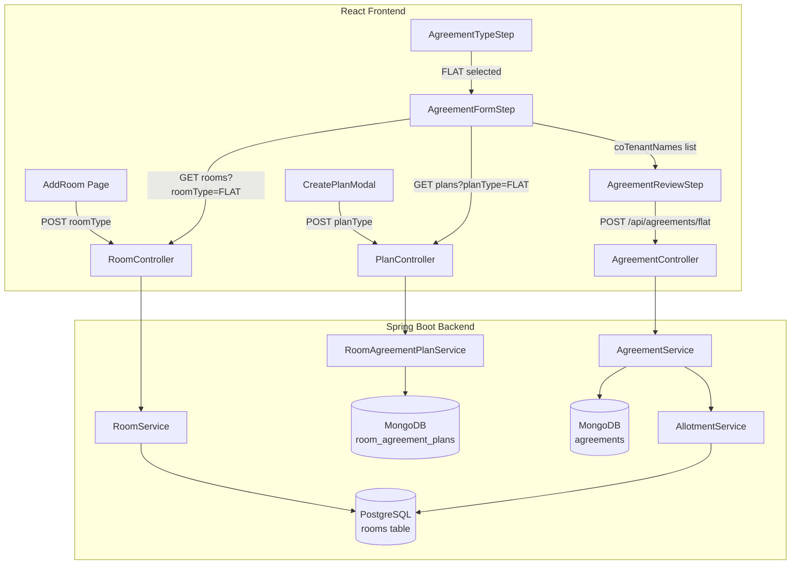
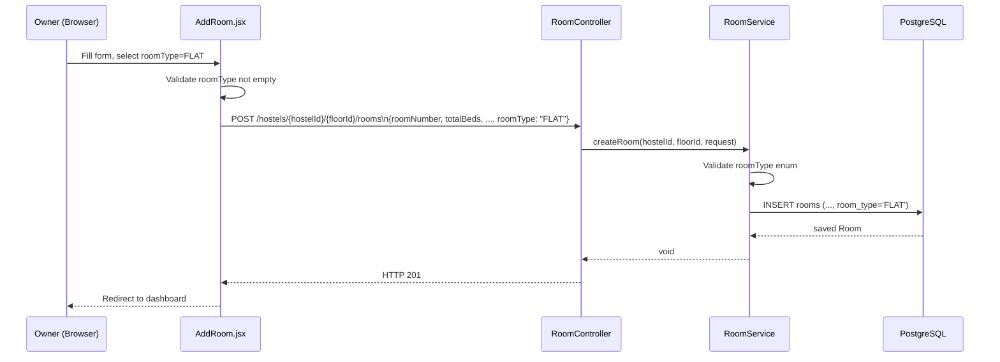
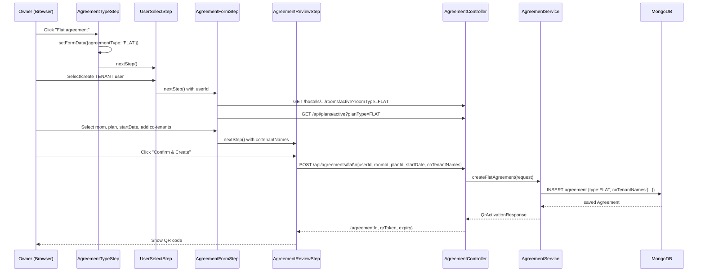
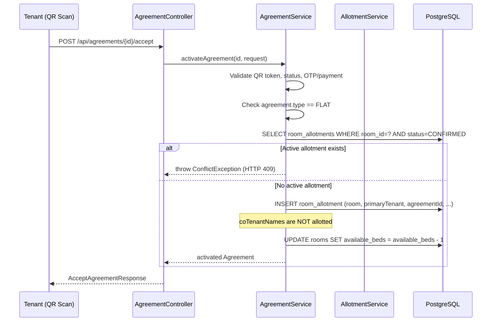

# Design Document: flat-pg-room-support

## Overview

This feature extends the hostel management system to support two distinct room types — **PG Rooms** and **Flats** — with type-aware agreement creation, plan filtering, and occupancy rules. The change is additive: all existing PG Room behaviour is preserved through null-safe defaults, and the new `FLAT` path is introduced as a parallel flow through the same stepper wizard.

The system spans a Spring Boot backend (PostgreSQL for rooms/allotments, MongoDB for agreements/plans) and a React + Vite frontend. The key changes are:

1. A `roomType` column (`PG_ROOM` | `FLAT`) on the PostgreSQL `rooms` table.
2. A `planType` field (`PG_ROOM` | `FLAT`) on the MongoDB `room_agreement_plans` collection.
3. A new `FLAT` value in the `AgreementType` enum and a `coTenantNames` field on the MongoDB `agreements` collection.
4. Type-aware filtering in the room listing and plan listing APIs.
5. A new "Flat agreement" card in the `AgreementTypeStep` and a co-tenant names sub-form in `AgreementFormStep`.
6. A dedicated `POST /api/agreements/flat` endpoint (or extended `POST /api/agreements/room`) that accepts `coTenantNames`.

---

## Architecture

The feature follows the existing layered architecture without introducing new services or infrastructure.



**Data flow summary:**
- Room creation: `AddRoom` → `POST /hostels/{hostelId}/{floorId}/rooms` with `roomType` field → `RoomService.createRoom` → persisted to PostgreSQL.
- Plan creation: `CreatePlanModal` → `POST /api/plans` with `planType` field → `RoomAgreementPlanService.createPlan` → persisted to MongoDB.
- Agreement creation (Flat): `AgreementStepper` → `POST /api/agreements/flat` with `coTenantNames` → `AgreementService.createFlatAgreement` → persisted to MongoDB.
- Agreement activation (Flat): QR scan → `POST /api/agreements/{id}/accept` → `AgreementService.activateAgreement` → single `RoomAllotment` created in PostgreSQL for primary tenant only.

---

## Components and Interfaces

### Backend Components

#### New Enum: `RoomType`
```java
// com.krunity.HostelManagment.enums.RoomType
public enum RoomType {
    PG_ROOM,
    FLAT
}
```

#### New Enum: `PlanType`
```java
// com.krunity.HostelManagment.enums.PlanType
public enum PlanType {
    PG_ROOM,
    FLAT
}
```

#### Updated Enum: `AgreementType`
```java
public enum AgreementType {
    ROOM,
    WORKER,
    FLAT   // new
}
```

#### Updated Entity: `Room` (PostgreSQL)
- Add `roomType` column of type `VARCHAR(20)` with default `'PG_ROOM'`.
- Mapped as `@Enumerated(EnumType.STRING)` using the `RoomType` enum.
- Null-safe: existing rows with `NULL` are treated as `PG_ROOM` in service logic.

#### Updated Document: `RoomAgreementPlan` (MongoDB)
- Add `planType` field of type `String` (values: `"PG_ROOM"` | `"FLAT"`).
- Existing documents without this field are treated as `PG_ROOM` in service logic.

#### Updated Document: `Agreement` (MongoDB)
- Add `coTenantNames` field: `List<String>` (0–5 entries, each ≤ 100 chars).
- The `type` field already exists; `FLAT` is added to the enum.

#### New DTO: `CreateFlatAgreementRequest`
```java
public class CreateFlatAgreementRequest {
    @NotNull UUID userId;          // primary tenant
    @NotNull UUID roomId;          // must be a FLAT room
    @NotBlank String planId;       // must be a FLAT plan
    @NotNull @FutureOrPresent LocalDate startDate;
    @Size(max = 5) List<@Size(max = 100) String> coTenantNames = new ArrayList<>();
}
```

#### Updated DTO: `CreateRoomRequest`
- Add `roomType` field of type `RoomType` with `@NotNull` validation.

#### Updated DTO: `CreatePlanRequest`
- Change `planType` field from `String` (currently defaults to `"ROOM_AGREEMENT"`) to use the new `PlanType` enum values `PG_ROOM` / `FLAT`, with `@NotNull` validation.

#### Updated DTO: `RoomResponse`
- Add `roomType` field of type `String` (serialised enum name).

#### Updated DTO: `PlanResponse`
- `planType` field already exists as `String`; no structural change needed — values change from `"ROOM_AGREEMENT"` to `"PG_ROOM"` or `"FLAT"`.

#### New/Updated API Endpoints

| Method | Path | Change |
|--------|------|--------|
| `POST` | `/hostels/{hostelId}/{floorId}/rooms` | Accept `roomType` in request body; validate enum |
| `GET` | `/hostels/{hostelId}/{floorId}/rooms/active` | Add optional `?roomType=` query param |
| `GET` | `/api/plans/active` | Add optional `?planType=` query param |
| `POST` | `/api/agreements/flat` | New endpoint for flat agreements with `coTenantNames` |

#### Updated `RoomController`
```java
@GetMapping("/active")
public ResponseEntity<?> getAllActiveRooms(
    @PathVariable String hostelId,
    @PathVariable String floorId,
    @RequestParam(required = false) String roomType) { ... }
```

#### Updated `PlanController`
```java
@GetMapping("/active")
public ResponseEntity<List<PlanResponse>> getActivePlans(
    @RequestParam(required = false) String planType) { ... }
```

#### New `AgreementController` endpoint
```java
@PostMapping("/flat")
public ResponseEntity<QrActivationResponse> createFlatAgreement(
    @Valid @RequestBody CreateFlatAgreementRequest request) { ... }
```

### Frontend Components

#### Updated `AddRoom.jsx`
- Add a `roomType` field to `formData` (required, no default).
- Add a `<select>` with options `PG_ROOM` → "PG Room" and `FLAT` → "Flat".
- Add validation: if `roomType` is empty, show inline error "Room type is required".
- Pass `roomType` in the `createRoom` API call payload.

#### Updated `CreatePlanModal.jsx`
- Change `planType` initial value from `'ROOM_AGREEMENT'` to `''` (no default).
- Add a `<select>` with options `PG_ROOM` → "PG Room" and `FLAT` → "Flat".
- Add validation: if `planType` is empty, show inline error "Plan type is required".
- Pass `planType` in the `createPlan` API call payload.

#### Updated `AgreementTypeStep.jsx`
- Add a third card: "Flat agreement" that calls `handleTypeSelect('FLAT')`.

#### Updated `UserSelectStep.jsx`
- Extend `getRoleFromAgreementType()` to return `'TENANT'` for `agreementType === 'FLAT'` (same as `ROOM`).

#### Updated `AgreementFormStep.jsx`
- When `formData.agreementType === 'FLAT'`:
  - Call `fetchRooms` with `?roomType=FLAT` query param.
  - Call `fetchPlans` with `?planType=FLAT` query param.
  - Show a "Co-tenants" sub-section with an "Add co-tenant" button and a list of entered names with remove buttons.
  - Validate: each name must be non-empty and ≤ 100 characters.
  - Store `coTenantNames` in `formData`.
- When `formData.agreementType === 'ROOM'`:
  - Call `fetchRooms` with `?roomType=PG_ROOM`.
  - Call `fetchPlans` with `?planType=PG_ROOM`.
  - Show empty-state messages when lists are empty.
- On submit, call `POST /api/agreements/flat` instead of `/api/agreements/room` for FLAT type.

#### Updated `AgreementReviewStep.jsx`
- When `formData.agreementType === 'FLAT'`:
  - Show a "Co-tenants" section listing each name from `formData.coTenantNames`, or "None" if empty.
  - Show the primary tenant's display name and the selected flat room number.
- Pass `coTenantNames` in the agreement payload when calling the API.

#### Updated `agreementService.js`
```js
createFlatAgreement: (data) => apiClient.post('/api/agreements/flat', data),
```

#### Updated `hostelService.js`
```js
getActiveRoomsByFloor: (hostelId, floorId, roomType) => {
  const params = roomType ? `?roomType=${roomType}` : '';
  return apiClient.get(`/hostels/${hostelId}/${floorId}/rooms/active${params}`);
},
```

---

## Data Models

### PostgreSQL: `rooms` table

```sql
ALTER TABLE rooms
  ADD COLUMN room_type VARCHAR(20) DEFAULT 'PG_ROOM';
```

Existing rows will have `room_type = NULL` after migration; service logic treats `NULL` as `PG_ROOM`.

| Column | Type | Notes |
|--------|------|-------|
| `room_id` | UUID PK | existing |
| `hostel_id` | UUID FK | existing |
| `floor_id` | UUID FK | existing |
| `room_number` | VARCHAR | existing |
| `room_details` | TEXT | existing |
| `total_beds` | INTEGER | existing |
| `available_beds` | INTEGER | existing |
| `is_active` | BOOLEAN | existing |
| `room_type` | VARCHAR(20) | **new** — `PG_ROOM` or `FLAT`, default `PG_ROOM` |

### MongoDB: `room_agreement_plans` collection

New field added to existing documents:

```json
{
  "_id": "...",
  "planName": "Standard PG Plan",
  "planType": "PG_ROOM",
  "status": "ACTIVE",
  "ownerId": "...",
  "rentDetails": { ... },
  ...
}
```

`planType` values: `"PG_ROOM"` | `"FLAT"`. Absent/null treated as `"PG_ROOM"`.

### MongoDB: `agreements` collection

New fields added to existing documents:

```json
{
  "_id": "...",
  "type": "FLAT",
  "status": "PENDING_TENANT_ACTION",
  "userId": "...",
  "roomId": "...",
  "ownerId": "...",
  "planId": "...",
  "planSnapshot": { ... },
  "startDate": "2025-08-01",
  "coTenantNames": ["Alice Smith", "Bob Jones"],
  "qrToken": "...",
  "qrExpiry": "...",
  "createdAt": "..."
}
```

`coTenantNames` is absent on `ROOM` and `WORKER` agreements (backward compatible).

---

## Data Flow Diagrams

### Room Creation with Type



### Flat Agreement Creation



### Flat Agreement Activation (Allotment)



---

## Correctness Properties

*A property is a characteristic or behavior that should hold true across all valid executions of a system — essentially, a formal statement about what the system should do. Properties serve as the bridge between human-readable specifications and machine-verifiable correctness guarantees.*

### Property 1: Room type round-trip

*For any* valid `CreateRoomRequest` with a `roomType` value in `{PG_ROOM, FLAT}`, creating the room and then retrieving it via the API SHALL return a `RoomResponse` whose `roomType` field equals the submitted value.

**Validates: Requirements 1.3, 1.4, 1.5**

---

### Property 2: Invalid room type is rejected

*For any* string value that is not a member of `{PG_ROOM, FLAT}`, submitting it as the `roomType` in a `CreateRoomRequest` SHALL cause the API to return HTTP 400.

**Validates: Requirements 1.6, 6.4**

---

### Property 3: Room type filter correctness

*For any* collection of rooms with mixed `roomType` values (including `NULL`), querying the active rooms endpoint with `?roomType=X` SHALL return exactly those rooms whose `roomType` equals `X` (where `NULL` is treated as `PG_ROOM`), and querying without the parameter SHALL return all rooms.

**Validates: Requirements 6.1, 6.2, 6.3, 8.1**

---

### Property 4: Plan type round-trip

*For any* valid `CreatePlanRequest` with a `planType` value in `{PG_ROOM, FLAT}`, creating the plan and then retrieving it SHALL return a `PlanResponse` whose `planType` field equals the submitted value.

**Validates: Requirements 3.4**

---

### Property 5: Plan type filter correctness

*For any* collection of plans with mixed `planType` values (including `NULL`/absent), querying the active plans endpoint with `?planType=PG_ROOM` SHALL return only plans whose `planType` is `PG_ROOM` or `NULL`/absent, and querying with `?planType=FLAT` SHALL return only plans whose `planType` is `FLAT`.

**Validates: Requirements 3.5, 3.6, 8.2, 8.4**

---

### Property 6: Flat agreement persistence round-trip

*For any* valid `CreateFlatAgreementRequest` with a `coTenantNames` list of 0–5 entries each ≤ 100 characters, creating the agreement SHALL persist a document with `type=FLAT`, the provided `roomId`, `userId`, `planId`, `startDate`, and the exact `coTenantNames` list, and the API response SHALL include a non-null `agreementId` and `qrToken`.

**Validates: Requirements 4.10, 7.4**

---

### Property 7: Flat activation creates exactly one allotment

*For any* flat agreement activation where no active `RoomAllotment` exists for the flat room, the activation SHALL create exactly one `RoomAllotment` record linking the flat room to the primary tenant, regardless of how many entries are in `coTenantNames`.

**Validates: Requirements 2.1, 2.5**

---

### Property 8: Duplicate flat activation is rejected

*For any* flat room that already has an active `RoomAllotment`, attempting to activate a new agreement for that room SHALL return HTTP 409.

**Validates: Requirements 2.8**

---

### Property 9: Co-tenant name list constraints

*For any* `CreateFlatAgreementRequest` where `coTenantNames` contains more than 5 entries, or any single entry exceeds 100 characters, the API SHALL return HTTP 400. *For any* list with 0–5 entries each ≤ 100 characters (including the empty list), the API SHALL accept the request.

**Validates: Requirements 2.3, 2.7**

---

### Property 10: Flat agreement required field validation

*For any* flat agreement creation request where any of `{type, roomId, userId}` is absent or null, the API SHALL return HTTP 400 identifying the missing field.

**Validates: Requirements 7.3**

---

### Property 11: Backward compatibility — null roomType treated as PG_ROOM

*For any* room record whose `room_type` column is `NULL`, the room SHALL appear in results when querying with `?roomType=PG_ROOM` and SHALL NOT appear when querying with `?roomType=FLAT`.

**Validates: Requirements 8.1**

---

### Property 12: Backward compatibility — ROOM agreements unchanged

*For any* agreement with `type=ROOM`, the activation flow SHALL produce the same allotment, payment plan, and payment schedule as before this feature was introduced, with no change in behaviour.

**Validates: Requirements 8.3**

---

## Error Handling

### Backend

| Scenario | HTTP Status | Error Message |
|----------|-------------|---------------|
| `roomType` missing in `CreateRoomRequest` | 400 | `"roomType: Room type is required"` |
| `roomType` value not in enum | 400 | `"roomType: Invalid room type. Allowed values: PG_ROOM, FLAT"` |
| `planType` missing in `CreatePlanRequest` | 400 | `"planType: Plan type is required"` |
| `roomType` query param invalid | 400 | `"Invalid roomType filter value. Allowed: PG_ROOM, FLAT"` |
| `planType` query param invalid | 400 | `"Invalid planType filter value. Allowed: PG_ROOM, FLAT"` |
| Flat activation — room already occupied | 409 | `"Room is already occupied. An active allotment exists for this flat."` |
| `coTenantNames` list > 5 entries | 400 | `"coTenantNames: Maximum 5 co-tenant names allowed"` |
| Co-tenant name > 100 characters | 400 | `"coTenantNames[i]: Co-tenant name must not exceed 100 characters"` |
| `userId` missing in flat agreement | 400 | `"userId: User ID is required"` |
| `roomId` missing in flat agreement | 400 | `"roomId: Room ID is required"` |

### Frontend

- **AddRoom**: Inline error below the room type selector when the field is empty on submit.
- **CreatePlanModal**: Inline error below the plan type selector when the field is empty on submit.
- **AgreementFormStep (FLAT)**: Empty-state message "No Flat plans available. Please create a Flat plan first." when the plans list is empty; "No Flat rooms available on this floor." when the rooms list is empty.
- **AgreementFormStep (ROOM)**: Empty-state message "No PG Room plans available. Please create a PG Room plan first." when the plans list is empty; "No PG Rooms available on this floor." when the rooms list is empty.
- **AgreementFormStep co-tenant input**: Inline error if a name exceeds 100 characters; the "Add co-tenant" button is disabled when the list already has 5 entries.
- **AgreementReviewStep**: Shows "None" in the Co-tenants section when `coTenantNames` is empty.

---

## Testing Strategy

### Unit Tests

**Backend:**
- `RoomService.createRoom` — verify `roomType` is mapped from request to entity.
- `RoomService.getAllActiveRooms` — verify `roomType` filter is applied correctly, including null-as-PG_ROOM behaviour.
- `RoomAgreementPlanService.getActivePlans` — verify `planType` filter returns correct subsets, including null-as-PG_ROOM.
- `AgreementService.createFlatAgreement` — verify `coTenantNames` is persisted, `type=FLAT` is set.
- `AgreementService.activateAgreement` (FLAT path) — verify exactly one allotment is created, no allotments for co-tenants.
- `AgreementService.activateAgreement` (FLAT path, conflict) — verify HTTP 409 when allotment already exists.
- `CreateFlatAgreementRequest` validation — verify `@Size` constraints on `coTenantNames`.

**Frontend:**
- `AddRoom` — renders room type selector with two options; shows error when submitted without selection.
- `CreatePlanModal` — renders plan type selector; shows error when submitted without selection.
- `AgreementTypeStep` — renders three cards including "Flat agreement".
- `AgreementFormStep` (FLAT) — fetches rooms with `roomType=FLAT`, fetches plans with `planType=FLAT`, shows co-tenant section.
- `AgreementFormStep` (ROOM) — fetches rooms with `roomType=PG_ROOM`, fetches plans with `planType=PG_ROOM`.
- `AgreementReviewStep` (FLAT) — displays co-tenants section; shows "None" when list is empty.

### Property-Based Tests

The project uses Java on the backend. The recommended PBT library is **[jqwik](https://jqwik.net/)** (JUnit 5 compatible, widely used in Spring Boot projects). Each property test runs a minimum of 100 iterations.

**Property 1 — Room type round-trip** (`Feature: flat-pg-room-support, Property 1: Room type round-trip`)
```java
@Property(tries = 100)
void roomTypeRoundTrip(@ForAll("validRoomRequests") CreateRoomRequest request) {
    // Create room, retrieve it, assert roomType matches
}
```

**Property 2 — Invalid room type rejected** (`Feature: flat-pg-room-support, Property 2: Invalid room type is rejected`)
```java
@Property(tries = 100)
void invalidRoomTypeRejected(@ForAll("invalidRoomTypeStrings") String invalidType) {
    // Submit with invalid roomType, assert HTTP 400
}
```

**Property 3 — Room type filter correctness** (`Feature: flat-pg-room-support, Property 3: Room type filter correctness`)
```java
@Property(tries = 100)
void roomTypeFilterCorrectness(@ForAll("mixedRoomCollections") List<Room> rooms) {
    // Seed DB, query with each filter, assert only matching rooms returned
}
```

**Property 4 — Plan type round-trip** (`Feature: flat-pg-room-support, Property 4: Plan type round-trip`)
```java
@Property(tries = 100)
void planTypeRoundTrip(@ForAll("validPlanRequests") CreatePlanRequest request) {
    // Create plan, retrieve it, assert planType matches
}
```

**Property 5 — Plan type filter correctness** (`Feature: flat-pg-room-support, Property 5: Plan type filter correctness`)
```java
@Property(tries = 100)
void planTypeFilterCorrectness(@ForAll("mixedPlanCollections") List<RoomAgreementPlan> plans) {
    // Seed MongoDB, query with each filter, assert correct subsets
}
```

**Property 6 — Flat agreement persistence round-trip** (`Feature: flat-pg-room-support, Property 6: Flat agreement persistence round-trip`)
```java
@Property(tries = 100)
void flatAgreementRoundTrip(@ForAll("validFlatAgreementRequests") CreateFlatAgreementRequest req) {
    // Create flat agreement, retrieve from MongoDB, assert all fields preserved
}
```

**Property 7 — Flat activation creates exactly one allotment** (`Feature: flat-pg-room-support, Property 7: Flat activation creates exactly one allotment`)
```java
@Property(tries = 100)
void flatActivationCreatesExactlyOneAllotment(@ForAll("validFlatActivations") FlatActivationScenario scenario) {
    // Activate flat agreement with varying coTenantNames, assert allotment count == 1
}
```

**Property 8 — Duplicate flat activation rejected** (`Feature: flat-pg-room-support, Property 8: Duplicate flat activation is rejected`)
```java
@Property(tries = 100)
void duplicateFlatActivationRejected(@ForAll("flatRoomsWithExistingAllotments") Room room) {
    // Attempt second activation, assert HTTP 409
}
```

**Property 9 — Co-tenant name list constraints** (`Feature: flat-pg-room-support, Property 9: Co-tenant name list constraints`)
```java
@Property(tries = 100)
void coTenantNameConstraints(@ForAll("coTenantNameLists") List<String> names) {
    // Valid lists (0-5, each ≤100 chars) accepted; invalid lists rejected with HTTP 400
}
```

**Property 11 — Null roomType treated as PG_ROOM** (`Feature: flat-pg-room-support, Property 11: Backward compatibility — null roomType treated as PG_ROOM`)
```java
@Property(tries = 100)
void nullRoomTypeTreatedAsPgRoom(@ForAll("roomsWithNullType") Room room) {
    // Room with null roomType appears in PG_ROOM filter, not in FLAT filter
}
```

### Integration Tests

- End-to-end flat agreement creation and activation using a test MongoDB and H2/PostgreSQL.
- Verify `ROOM` agreement activation behaviour is unchanged after the feature is introduced (backward compatibility — Property 12).
- Verify billing records for an active flat agreement reference only the primary tenant's `userId`.
